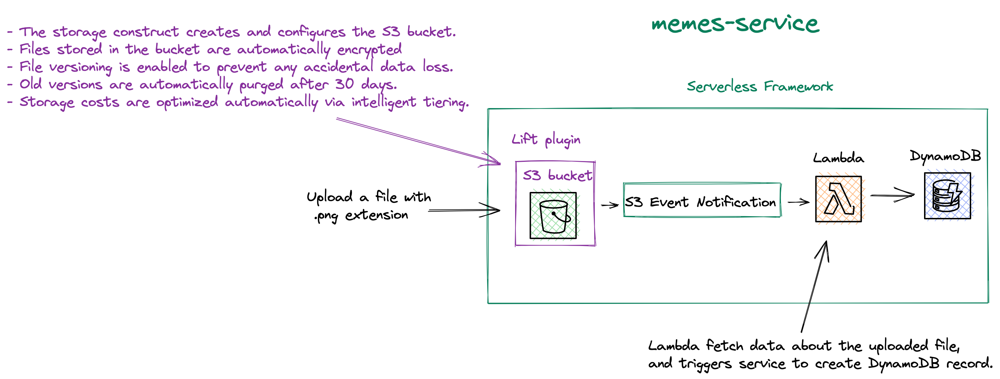
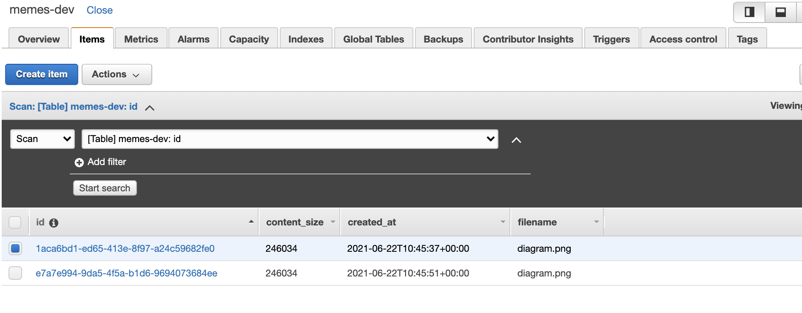
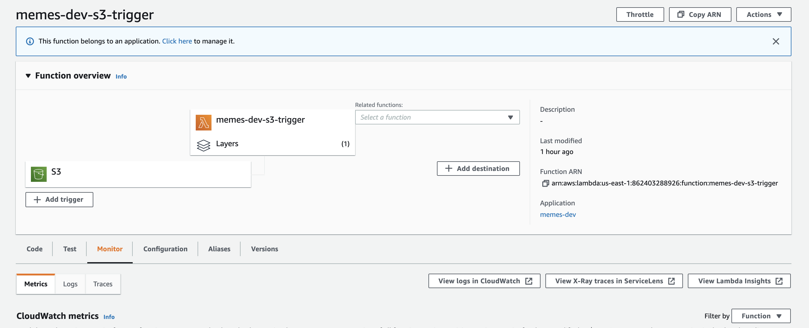
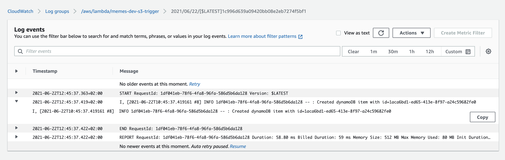

# Serverless AWS Ruby S3 Event Notifications with Lambda and DynamoDB

This is an example of a serverless application written in Ruby, using the [Serverless Framework](https://serverless.com/) along with the [Lift](https://github.com/getlift/lift) plugin, which allows you to use [constructs](https://docs.aws.amazon.com/cdk/latest/guide/constructs.html) from the AWS CDK to the Amazon Web Services `cloud`.

 In this particular case, we are using a [storage](https://github.com/getlift/lift/blob/master/docs/storage.md) construct that creates and configures the S3 bucket.

In this example, we have an `S3 bucket` that has `Event Notification` set. Every time we upload an meme image with `.png `extension to the created S3 bucket, S3 event notification on this bucket triggers Lambda function, which will call a service that will create a record in the DynamoDB database with information about the uploaded file.

More information about S3 Event Notifications could be found [here](https://docs.aws.amazon.com/AmazonS3/latest/userguide/NotificationHowTo.html#notification-how-to-event-types-and-destinations).

## Diagram



## Setup

`npm install` to install all needed packages.

## Deployment

In order to deploy the service run:

```bash
sls deploy
```

for deploying with a specific `profile` (located in `~/.aws/credentials`) you can simply use the command:

```bash
AWS_PROFILE=YOUR_PROFILE_NAME sls deploy
```

for deploying to the specific stage, let's say `staging` do:

```bash
sls deploy --stage staging
```

The expected result should be similar to:

```bash
Serverless: Running "serverless" installed locally (in service node_modules)
Serverless: Packaging service...
Serverless: Excluding development dependencies...
Serverless: Clearing previous build ruby layer build
[ '2.1' ]
Serverless: Installing gem using local bundler
Serverless: Zipping the gemfiles to meme-uploader/blog-starter-app/.serverless/ruby_layer/gemLayer.zip
Serverless: Configuring Layer and GEM_PATH to the functions
Serverless: Installing dependencies for custom CloudFormation resources...
Serverless: Uploading CloudFormation file to S3...
Serverless: Uploading artifacts...
Serverless: Uploading service memes.zip file to S3 (1.72 KB)...
Serverless: Uploading service gemLayer.zip file to S3 (640.26 KB)...
Serverless: Uploading custom CloudFormation resources...
Serverless: Validating template...
Serverless: Updating Stack...
Serverless: Checking Stack update progress...
................
Serverless: Stack update finished...
Service Information
service: memes
stage: dev
region: us-east-1
stack: memes-dev
resources: 13
api keys:
  None
endpoints:
  None
functions:
  s3-trigger: memes-dev-s3-trigger
layers:
  gem: arn:aws:lambda:us-east-1:XXXXXXXXXXXX:layer:memes-dev-ruby-bundle:8
memes:
  bucketName: memes-dev-memesbucketxxxxxxx-xxxxxxxx
```

## Usage

After the deployment head to the S3 bucket that was created (`bucketName: memes-dev-memesbucketxxxxxxx-xxxxxxxx`) in the AWS Dashboard, and add the file with the `.png` extension.

<a href="https://imgur.com/CXFzjEr"></a>

An S3 event notification will be created, which will trigger the Lambda function that will take the data from the event notification, pass it to the service that will create a new record in DynamoDB.

You could create multiple Events, each of which has a different suffix. But you can't create one Event with multiple suffixes. An alternative is to create an Event for any suffix (any file type), and have the Lambda function examine the filename and exit if it has an uninteresting suffix.

If I want to support multiple suffixes with different file extensions, there are two ways to do it:

1. You could create multiple Events, each of which has a different suffix. But you can't create one Event with multiple suffixes.
2. Separate Lambda Function that will check the extension.


To check created records check your DynamoDB table:




*Important*: The DynamoDB table name is a combination of service name and stage. For the `dev` stage it will be:

```
memes-dev
```
### For checking the CloudWatch logs:

 - from lambda dashboard the `s3-trigger` function:



 - directly from CloudWatch logs `s3-trigger` function:




## Log retention

The log retention is setup for 30 days. To change it simply change the value of this attribute in `serverless.yml` file:

``` bash
logRetentionInDays: 30
```

## Structure

| Path                                                | Explanation                                                                                                                                                                          |
|-----------------------------------------------------|--------------------------------------------------------------------------------------------------------------------------------------------------------------------------------------|
| `./src`                                               | All code for the project.                                                                                                                                                            |
| `./src/handlers/s3-trigger/handler`                   | Lambda function for processing S3 event notification and triggering create_meme_record_service for the purpose of creating a record for DynamoDB.                                    |
| `./src/common/`                                       | Space for common, reusable pieces of code.                                                                                                                                           |
| `./src/common/adapters/dynamo_db_adapter.rb`          | Adapter for communication with DynamoDB with the usage of AWS SDK for Ruby. Only used for creating new records.                                                                      |
| `./src/common/services/create_meme_record_service.rb` | The service object pattern is widely used within ruby/rails developers. A class that is responsible for doing only one thing. In our case is creating a meme record to the DynamoDB. |


## Serverless plugins

For this example, there are two serverless plugins used:

|Plugin|Explanation|
|------------------------------------------------------------------------------|------------------------------------------------------------------------------------------------------------------------------------------------------------------|
| [serverless-ruby-layer](https://www.npmjs.com/package/serverless-ruby-layer) | For bundling ruby gems from  `Gemfile` and deploys them to the lambda layer.                                                                                     |
| [serverless-lift](https://www.npmjs.com/package/serverless-lift)             | For using AWS CDK construct within the Serverless Framework. In this example,  [storage construct](https://github.com/getlift/lift/blob/master/docs/storage.md). |


## Ruby gems

|Gem|Explanation|
|------------------------------------------------------------------------------|------------------------------------------------------------------------------------------------------------------------------------------------------------------|
| `aws-sdk-dynamodb` | It's a part of the AWS SDK for Ruby. Used for DynamoDB, in the case of this example - the creation of the new record.                                                                                     |

## Eject from the Lift plugin

A very cool aspect is the [eject](https://github.com/getlift/lift#ejecting). In case your project grows beyond the plugin, you can eject from `Lift` at any time, as the plugin is based on `CloudFormation`. You're not chained to Lift at all.

## Remove service

To remove the service do:

```bash
sls remove
```
And the stack will be removed from the AWS.